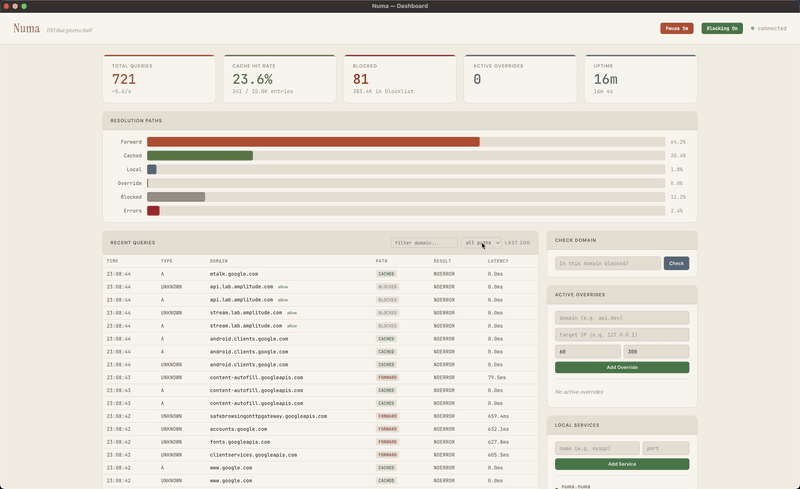

# Numa

[](https://github.com/razvandimescu/numa/actions)
[](https://crates.io/crates/numa)
[](LICENSE)

**DNS you own. Everywhere you go.** — [numa.rs](https://numa.rs)

A portable DNS resolver in a single binary. Block ads on any network, name your local services (`frontend.numa`), and override any hostname with auto-revert — all from your laptop, no cloud account or Raspberry Pi required.

Built from scratch in Rust. Zero DNS libraries. RFC 1035 wire protocol parsed by hand. Recursive resolution from root nameservers with full DNSSEC validation (chain-of-trust + NSEC/NSEC3 denial proofs). One ~8MB binary, no PHP, no web server, no database — everything is embedded.



## Quick Start

```bash
# Install (pick one)
brew install razvandimescu/tap/numa
cargo install numa
curl -fsSL https://raw.githubusercontent.com/razvandimescu/numa/main/install.sh | sh

# Run (port 53 requires root)
sudo numa

# Try it
dig @127.0.0.1 google.com           # ✓ resolves normally
dig @127.0.0.1 ads.google.com       # ✗ blocked → 0.0.0.0
```

Open the dashboard: **http://numa.numa** (or `http://localhost:5380`)

Or build from source:
```bash
git clone https://github.com/razvandimescu/numa.git && cd numa
cargo build --release
sudo ./target/release/numa
```

## Why Numa

- **Local service proxy** — `https://frontend.numa` instead of `localhost:5173`. Auto-generated TLS certs, WebSocket support for HMR. Like `/etc/hosts` but with auto TLS, a REST API, LAN discovery, and auto-revert.
- **Path-based routing** — `app.numa/api → :5001`, `app.numa/auth → :5002`. Route URL paths to different backends with optional prefix stripping. Like nginx location blocks, zero config files.
- **LAN service discovery** — Numa instances on the same network find each other automatically via mDNS. Access a teammate's `api.numa` from your machine. Opt-in via `[lan] enabled = true`.
- **Developer overrides** — point any hostname to any IP, auto-reverts after N minutes. Full REST API for scripting. Built-in diagnostics: `curl localhost:5380/diagnose/example.com` tells you exactly how any domain resolves.
- **DNS-over-HTTPS** — upstream queries encrypted via DoH. Your ISP sees HTTPS traffic, not DNS queries. Set `address = "https://9.9.9.9/dns-query"` in `[upstream]` or any DoH provider.
- **Ad blocking that travels with you** — 385K+ domains blocked via [Hagezi Pro](https://github.com/hagezi/dns-blocklists). Works on any network: coffee shops, hotels, airports.
- **Sub-microsecond caching** — 691ns cached round-trip, ~2.0M queries/sec throughput, zero heap allocations in the I/O path. [Benchmarks](bench/).
- **Live dashboard** — real-time stats, query log, blocking controls, service management. LAN accessibility badges show which services are reachable from other devices.
- **macOS, Linux, and Windows** — `numa install` configures system DNS, `numa service start` runs as launchd/systemd service.

## Local Service Proxy

Name your local dev services with `.numa` domains:

```bash
curl -X POST localhost:5380/services \
  -H 'Content-Type: application/json' \
  -d '{"name":"frontend","target_port":5173}'

open http://frontend.numa            # → proxied to localhost:5173
```

- **HTTPS with green lock** — auto-generated local CA + per-service TLS certs
- **WebSocket** — Vite/webpack HMR works through the proxy
- **Health checks** — dashboard shows green/red status per service
- **LAN sharing** — services bound to `0.0.0.0` are automatically discoverable by other Numa instances on the network. Dashboard shows "LAN" or "local only" per service.
- **Path-based routing** — route URL paths to different backends:
  ```toml
  [[services]]
  name = "app"
  target_port = 3000
  routes = [
      { path = "/api", port = 5001 },
      { path = "/auth", port = 5002, strip = true },
  ]
  ```
  `app.numa/api/users → :5001/api/users`, `app.numa/auth/login → :5002/login` (stripped)
- **Persistent** — services survive restarts
- Or configure in `numa.toml`:

```toml
[[services]]
name = "frontend"
target_port = 5173
```

## LAN Service Discovery

Run Numa on multiple machines. They find each other automatically:

```
Machine A (192.168.1.5)              Machine B (192.168.1.20)
┌──────────────────────┐             ┌──────────────────────┐
│ Numa                 │    mDNS     │ Numa                 │
│  services:           │◄───────────►│  services:           │
│   - api (port 8000)  │  discovery  │   - grafana (3000)   │
│   - frontend (5173)  │             │                      │
└──────────────────────┘             └──────────────────────┘
```

From Machine B:
```bash
dig @127.0.0.1 api.numa          # → 192.168.1.5
curl http://api.numa              # → proxied to Machine A's port 8000
```

Enable LAN discovery:
```bash
numa lan on
```
Or in `numa.toml`:
```toml
[lan]
enabled = true
```
Uses standard mDNS (`_numa._tcp.local` on port 5353) — compatible with Bonjour/Avahi, silently dropped by corporate firewalls instead of triggering IPS alerts.

**Hub mode** — don't want to install Numa on every machine? Run one instance as a shared DNS server and point other devices to it:

```bash
# On the hub machine, bind to LAN interface
[server]
bind_addr = "0.0.0.0:53"

# On other devices, set DNS to the hub's IP
# They get .numa resolution, ad blocking, caching — zero install
```

## How It Compares

| | Pi-hole | AdGuard Home | NextDNS | Cloudflare | Numa |
|---|---|---|---|---|---|
| Local service proxy | No | No | No | No | `.numa` + HTTPS + WS |
| Path-based routing | No | No | No | No | Prefix match + strip |
| LAN service discovery | No | No | No | No | mDNS, opt-in |
| Developer overrides | No | No | No | No | REST API + auto-expiry |
| Recursive resolver | No | No | Cloud only | Cloud only | From root hints, DNSSEC |
| Encrypted upstream (DoH) | No (needs cloudflared) | Yes | Cloud only | Cloud only | Native, single binary |
| Portable (travels with laptop) | No (appliance) | No (appliance) | Cloud only | Cloud only | Single binary |
| Zero config | Complex | Docker/setup | Yes | Yes | Works out of the box |
| Ad blocking | Yes | Yes | Yes | Limited | 385K+ domains |
| Data stays local | Yes | Yes | Cloud | Cloud | 100% local |

## How It Works

```
Query → Overrides → .numa TLD → Blocklist → Local Zones → Cache → Recursive/Forward
```

Two resolution modes: **forward** (relay to upstream like Quad9/Cloudflare) or **recursive** (resolve from root nameservers — no upstream dependency). Set `mode = "recursive"` in `[upstream]` to resolve independently.

No DNS libraries — no `hickory-dns`, no `trust-dns`. The wire protocol — headers, labels, compression pointers, record types — is parsed and serialized by hand. Runs on `tokio` + `axum`, async per-query task spawning.

[Configuration reference](numa.toml)

## Roadmap

- [x] DNS proxy core — forwarding, caching, local zones
- [x] Developer overrides — REST API with auto-expiry
- [x] Ad blocking — 385K+ domains, live dashboard, allowlist
- [x] System integration — macOS + Linux, launchd/systemd, Tailscale/VPN auto-discovery
- [x] Local service proxy — `.numa` domains, HTTP/HTTPS proxy, auto TLS, WebSocket
- [x] Path-based routing — URL prefix routing with optional strip, REST API
- [x] LAN service discovery — mDNS auto-discovery (opt-in), cross-machine DNS + proxy
- [x] DNS-over-HTTPS — encrypted upstream via DoH (Quad9, Cloudflare, any provider)
- [x] Recursive resolution — resolve from root nameservers, no upstream dependency
- [x] DNSSEC validation — chain-of-trust, NSEC/NSEC3 denial proofs, AD bit (RSA, ECDSA, Ed25519)
- [ ] pkarr integration — self-sovereign DNS via Mainline DHT (15M nodes)
- [ ] Global `.numa` names — self-publish, DHT-backed, first-come-first-served

## License

MIT
