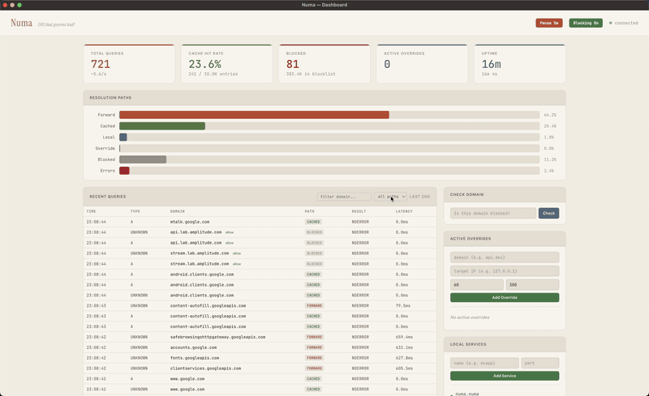

# Numa

[](https://github.com/razvandimescu/numa/actions)
[](https://crates.io/crates/numa)
[](LICENSE)

**DNS you own. Everywhere you go.** — [numa.rs](https://numa.rs)

A portable DNS resolver in a single binary. Block ads on any network, name your local services (`frontend.numa`), override any hostname with auto-revert, and seal every outbound query with **ODoH (RFC 9230)** so no single party sees both who you are and what you asked — all from your laptop, no cloud account or Raspberry Pi required.

Built from scratch in Rust. Zero DNS libraries. Caching, ad blocking, and local service domains out of the box. Optional recursive resolution from root nameservers with full DNSSEC chain-of-trust validation, plus a DNS-over-TLS listener for encrypted client connections (iOS Private DNS, systemd-resolved, etc.). Run `numa relay` and the same binary becomes a public ODoH endpoint too — the curated DNSCrypt list currently has one surviving relay, so every Numa deploy materially expands the ecosystem. One ~8MB binary, everything embedded.



## Quick Start

```bash
# macOS
brew install razvandimescu/tap/numa

# Linux
curl -fsSL https://raw.githubusercontent.com/razvandimescu/numa/main/install.sh | sh

# Arch Linux
pacman -S numa

# Windows — download from GitHub Releases
# All platforms
cargo install numa

# Docker
docker run -d --name numa --network host ghcr.io/razvandimescu/numa

# Nix
nix run github:razvandimescu/numa
```

```bash
sudo numa                              # run in foreground (port 53 requires root/admin)
```

Open the dashboard: **http://numa.numa** (or `http://localhost:5380`)

Set as system DNS:

| Platform | Install | Uninstall |
|----------|---------|-----------|
| macOS | `sudo numa install` | `sudo numa uninstall` |
| Linux | `sudo numa install` | `sudo numa uninstall` |
| Windows | `numa install` (admin) + reboot | `numa uninstall` (admin) + reboot |

On macOS and Linux, numa runs as a system service (launchd/systemd). On Windows, numa auto-starts on login via registry. Windows also binds `127.0.0.2:53` (the built-in Dnscache owns `127.0.0.1:53`) and installs an NRPT rule to route queries to it — so edit `bind_addr`/`api_bind_addr` against `127.0.0.2`, not `127.0.0.1`.

## Local Services

Name your dev services instead of remembering port numbers:

```bash
curl -X POST localhost:5380/services \
  -d '{"name":"frontend","target_port":5173}'
```

Now `https://frontend.numa` works in your browser — green lock, valid cert, WebSocket passthrough for HMR. No mkcert, no nginx, no `/etc/hosts`.

Add path-based routing (`app.numa/api → :5001`), share services across machines via LAN discovery, or configure everything in [`numa.toml`](numa.toml).

## Ad Blocking & Privacy

Ad and tracker blocking via [Hagezi Pro](https://github.com/hagezi/dns-blocklists), refreshed daily. Works on any network — coffee shops, hotels, airports. Travels with your laptop.

Three resolution modes:

- **`forward`** (default) — transparent proxy to your existing system DNS. Everything works as before, just with caching and ad blocking on top. Captive portals, VPNs, corporate DNS — all respected.
- **`recursive`** — resolve directly from root nameservers. No upstream dependency, no single entity sees your full query pattern. Add `[dnssec] enabled = true` for full chain-of-trust validation.
- **`auto`** — probe root servers on startup, recursive if reachable, otherwise forward over DoH to Quad9 (`https://9.9.9.9/dns-query`), which then sees your queries. Use `forward` with your own `[upstream]` to pick a different provider.

DNSSEC validates the full chain of trust: RRSIG signatures, DNSKEY verification, DS delegation, NSEC/NSEC3 denial proofs. [Read how it works →](https://numa.rs/blog/posts/dnssec-from-scratch.html)

**DNS-over-TLS listener** (RFC 7858) — accept encrypted queries on port 853 from strict clients like iOS Private DNS, systemd-resolved, or stubby. Two modes:

- **Self-signed** (default) — numa generates a local CA automatically. `numa install` adds it to the system trust store on macOS, Linux (Debian/Ubuntu, Fedora/RHEL/SUSE, Arch), and Windows. On iOS, install the `.mobileconfig` from `numa setup-phone`. Firefox keeps its own NSS store and ignores the system one — trust the CA there manually if you need HTTPS for `.numa` services in Firefox.
- **Bring-your-own cert** — point `[dot] cert_path` / `key_path` at a publicly-trusted cert (e.g., Let's Encrypt via DNS-01 challenge on a domain pointing at your numa instance). Clients connect without any trust-store setup — same UX as AdGuard Home or Cloudflare `1.1.1.1`.

ALPN `"dot"` is advertised and enforced in both modes; a handshake with mismatched ALPN is rejected as a cross-protocol confusion defense.

**Oblivious DoH** (RFC 9230) — set `[upstream] mode = "odoh"` with a `relay` and `target` ([recipe](recipes/odoh-upstream.md)) and every outbound query is HPKE-sealed to the target's key and sent through the relay. The relay sees your IP and ciphertext. The target sees the question and the relay's IP. Neither gets both, and a relay that redirects the query elsewhere only produces something the new destination cannot decrypt. Numa refuses a relay and target that share a host or a registrable domain, since the property depends on distinct operators. What ODoH does not hide: the connection you open afterwards. Your ISP still sees the IP you connect to and, without ECH, the hostname in the TLS handshake. ODoH removes the resolver as a party that can link you to your queries, nothing more. If you trust no third party at all, `recursive` mode involves none, at the cost of plaintext queries to authoritative servers.

**Phone setup** — point your iPhone or Android at Numa in one step:

```bash
numa setup-phone
```

Prints a QR code. Scan it, install the profile, toggle certificate trust — your phone's DNS now routes through Numa over TLS. Requires `[mobile] enabled = true` in `numa.toml`.

## LAN Discovery

Run Numa on multiple machines. They find each other automatically via mDNS:

```
Machine A (192.168.1.5)              Machine B (192.168.1.20)
┌──────────────────────┐             ┌──────────────────────┐
│ Numa                 │    mDNS     │ Numa                 │
│  - api (port 8000)   │◄───────────►│  - grafana (3000)    │
│  - frontend (5173)   │  discovery  │                      │
└──────────────────────┘             └──────────────────────┘
```

From Machine B: `curl http://api.numa` → proxied to Machine A's port 8000. Enable with `numa lan on`.

**Hub mode**: run one instance with `bind_addr = "0.0.0.0:53"` and point other devices' DNS to it — they get ad blocking + `.numa` resolution without installing anything. `bind_addr` also accepts a list to bind a specific subset of interfaces.

## Docker

```bash
# Recommended — host networking (Linux)
docker run -d --name numa --network host ghcr.io/razvandimescu/numa

# Port mapping (macOS/Windows Docker Desktop)
docker run -d --name numa -p 53:53/udp -p 53:53/tcp -p 5380:5380 ghcr.io/razvandimescu/numa
```

Dashboard at `http://localhost:5380`. The image binds the API and proxy to `0.0.0.0` by default. Override with a custom config:

```bash
docker run -d --name numa --network host \
  -v /path/to/numa.toml:/root/.config/numa/numa.toml \
  ghcr.io/razvandimescu/numa
```

Multi-arch: `linux/amd64` and `linux/arm64`.

Turnkey compose recipes:
- [`packaging/client/`](packaging/client/) — ODoH client mode (anonymous DNS), Numa + starter `numa.toml`.
- [`packaging/relay/`](packaging/relay/) — public ODoH relay, Numa + Caddy + ACME.

## How It Compares

| | Pi-hole | AdGuard Home | Unbound | Numa |
|---|---|---|---|---|
| Local service proxy + auto TLS | — | — | — | `.numa` domains, HTTPS, WebSocket |
| LAN service discovery | — | — | — | mDNS, zero config |
| Developer overrides (REST API) | — | — | — | Auto-revert, scriptable |
| Recursive resolver | — | — | Yes | Yes, with SRTT selection |
| DNSSEC validation | — | — | Yes | Yes (RSA, ECDSA, Ed25519) |
| Ad blocking | Yes | Yes | — | Hagezi Pro |
| Per-client rules | Groups | Yes | Views / tags | By CIDR (`[[client_policy]]`), config file only |
| Web admin UI | Full | Full | — | Dashboard |
| Encrypted upstream (DoH/DoT) | Needs cloudflared | DoH only | DoT only | DoH + DoT (`tls://`) |
| Encrypted clients (DoT listener) | Needs stunnel sidecar | Yes | Yes | Native (RFC 7858) |
| DoH server endpoint | — | Yes | — | Yes (RFC 8484) |
| Request hedging | — | — | — | All protocols (UDP, DoH, DoT) |
| Serve-stale + prefetch | — | — | Prefetch at 90% TTL | RFC 8767, prefetch at 90% TTL |
| Conditional forwarding | — | Yes | Yes | Yes (per-suffix rules) |
| Portable (laptop) | No (appliance) | No (appliance) | Server | Single binary, macOS/Linux/Windows |
| Community maturity | 56K stars, 10 years | 33K stars | 20 years | New |

## Performance

0.1ms cached queries — matches Unbound and AdGuard Home. Wire-level cache stores raw bytes with in-place TTL patching. Request hedging eliminates p99 spikes: cold recursive p99 538ms vs Unbound 748ms (−28%), σ 4× tighter. [Benchmarks →](benches/)

## FAQ

**Why no DNS library (hickory)?** The wire-protocol parser was a learning project written to understand RFC 1035, and the features were added on top of it one by one. `hickory` is a dev-dependency, used as a test oracle. The cost is real: protocol bugs are this project's to fix, which is why the parsers are fuzzed in CI.

**Was AI used?** Yes. The wire-protocol parser was written by hand. Later features (recursive resolver, DNSSEC validation, dashboard) were built with AI assistance, and reviewed, tested and debugged by the maintainer. The git history shows the progression.

**How much memory does it need?** About 31 MB measured with a 390K-domain blocklist: 23 MB of that is the blocklist, 4 MB the cache, 4 MB everything else. It runs on a Pi Zero.

**Does it run as root?** Binding port 53 needs privilege, so `sudo numa` in the foreground does. The Linux service does not: the systemd unit uses `DynamicUser=yes` with only `CAP_NET_BIND_SERVICE`. The macOS launchd daemon runs as root. To avoid privilege entirely, set `bind_addr` to a high port and pass `--no-system-dns`.

**What about systemd-resolved?** `numa install` detects it and writes a drop-in that points it at Numa and turns off its stub listener, and `numa uninstall` removes the drop-in. Any other process holding port 53 (dnsmasq, including the one NetworkManager spawns) has to be stopped or moved by hand. Numa reports the conflict at startup but does not resolve it.

**What is the local CA, and how do I remove it?** Numa generates a CA on first start to sign certificates for `.numa` services and the self-signed DoT listener. It lives in the data directory (`/var/lib/numa` on Linux, `/usr/local/var/numa` on macOS, `%PROGRAMDATA%\numa` on Windows) with the key readable by its owner only. `numa install` adds it to the system trust store and `numa uninstall` removes it. The CA is not needed if you bring your own certificates: `[proxy]` and `[dot]` both accept `cert_path` / `key_path`.

**Why "Numa"?** *Nume* is Romanian for "name". No relation to NUMA memory.

## Learn More

- [Blog: Numa as your tailnet resolver](https://numa.rs/blog/posts/numa-tailnet-resolver.html)
- [Blog: DNS-over-TLS from Scratch in Rust](https://numa.rs/blog/posts/dot-from-scratch.html)
- [Blog: Implementing DNSSEC from Scratch in Rust](https://numa.rs/blog/posts/dnssec-from-scratch.html)
- [Blog: I Built a DNS Resolver from Scratch](https://numa.rs/blog/posts/dns-from-scratch.html)
- [Configuration reference](numa.toml) — all options documented inline; `numa config path` shows which file your install is using, `numa config edit` opens it
- [REST API](src/api.rs) — overrides, cache, blocking, services, diagnostics
- [numa-metrics](https://github.com/razvandimescu/numa-metrics) — durable query history & analytics, off-host by design (no SD-card writes)

## Roadmap

- [x] DNS forwarding, caching, ad blocking, developer overrides
- [x] `.numa` local domains — auto TLS, path routing, WebSocket proxy
- [x] LAN service discovery — mDNS, cross-machine DNS + proxy
- [x] DNS-over-HTTPS — encrypted upstream + server endpoint (RFC 8484)
- [x] DNS-over-TLS — encrypted client listener (RFC 7858) + upstream forwarding (`tls://`)
- [x] Oblivious DoH — anonymized client mode + public relay (`numa relay`, RFC 9230)
- [x] Recursive resolution + DNSSEC — chain-of-trust, NSEC/NSEC3
- [x] SRTT-based nameserver selection
- [x] Multi-forwarder failover — multiple upstreams with SRTT ranking, fallback pool
- [x] Request hedging — parallel requests rescue packet loss and tail latency (all protocols)
- [x] Serve-stale + prefetch — RFC 8767, background refresh at <10% TTL and on stale serve
- [x] Conditional forwarding — per-suffix rules for split-horizon DNS (Tailscale, VPNs)
- [x] Cache warming — proactive resolution for configured domains
- [x] Mobile onboarding — `setup-phone` QR flow, mobile API, mobileconfig profiles
- [ ] pkarr integration — self-sovereign DNS via Mainline DHT
- [ ] Global `.numa` names — DHT-backed, no registrar

## License

MIT
